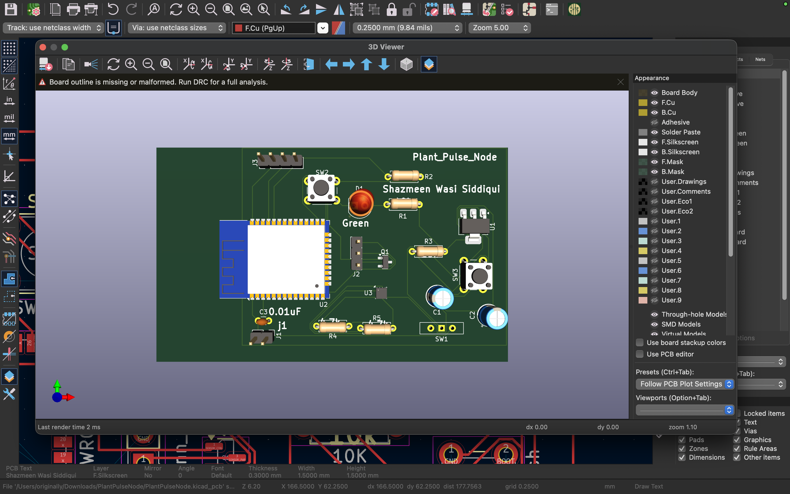
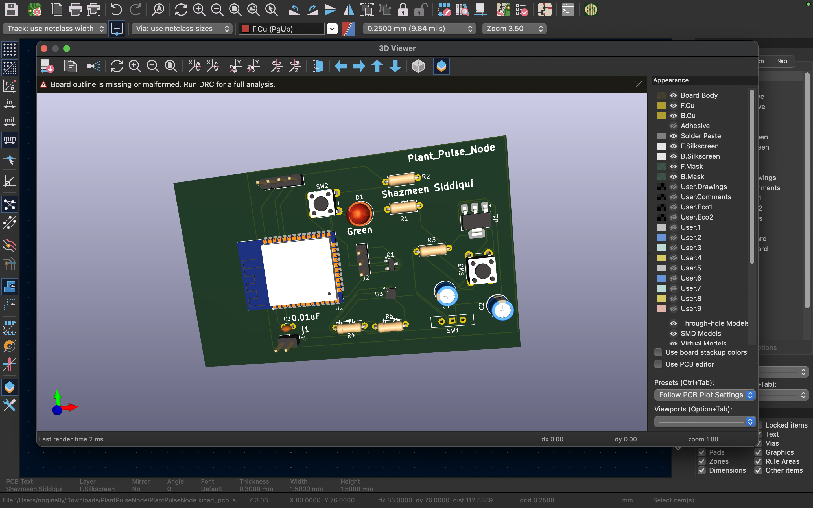
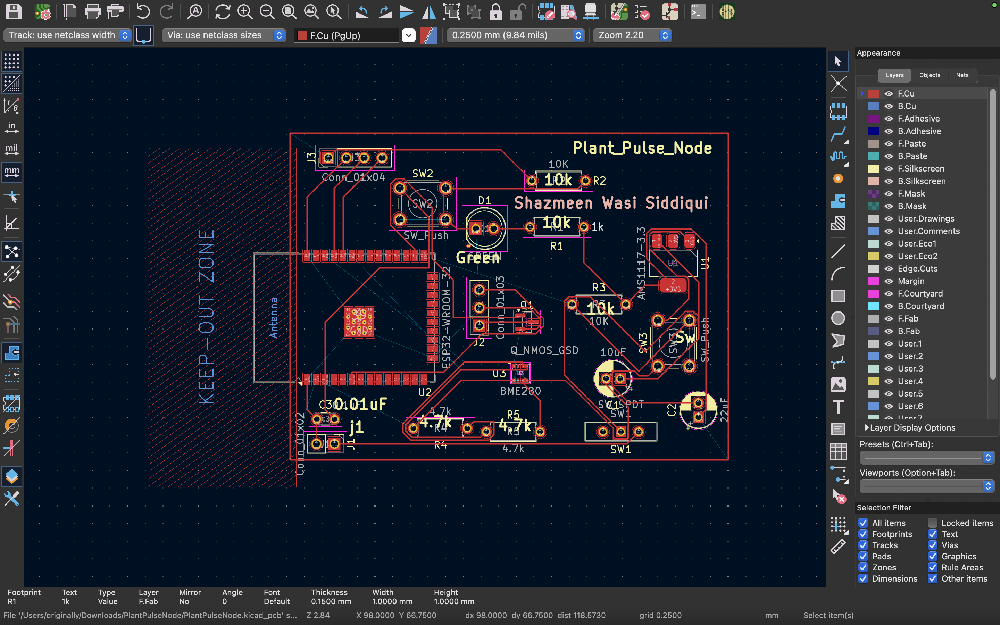
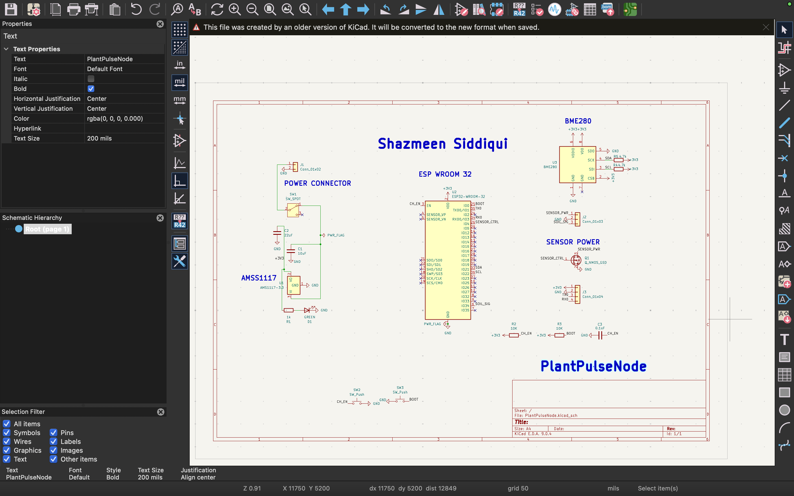

# 🌱 Plant Pulse — Low Power IoT Plant Monitoring Node






---

## 👩‍💻 Author

**Shazmeen Siddiqui**
B.Tech Electrical and Computing Engineering (4th Semester)
Jamia Millia Islamia

---

## 🚀 Project Overview

Plant Pulse is a **low-power IoT-based plant monitoring system** designed to eliminate the need for constant manual checking of plant health.

This project originated from a real-world problem — repeated failure to maintain plant health due to lack of consistent monitoring and actionable data.

Instead of relying on guesswork, Plant Pulse provides:

* 📊 Environmental data monitoring
* 🔋 Ultra low power operation
* 🤖 Autonomous sensing and reporting

---

## 💡 Problem Statement

Most plant care failures are not due to negligence, but due to:

* Lack of real-time environmental data
* Inconsistent monitoring habits
* Inefficient IoT systems that require frequent charging

Traditional IoT devices introduce a **"Power Problem"**:

> Devices run out of battery quickly, replacing one manual task with another.

---

## ⚙️ Technical Architecture

### 🧠 Core Components

* **ESP32 MCU** — Main processing and communication unit
* **BME280 Sensor** — Temperature, humidity, and pressure sensing
* **P-Channel MOSFET** — Power gating control

---

### 🔑 Key Design Innovation

The system implements **power gating using a P-channel MOSFET**:

* Sensors are **completely powered OFF** when not in use
* Eliminates idle current draw
* Dramatically increases battery life

This enables true low-power operation beyond standard sleep modes.

---

## 🔄 System Workflow

The device operates in a cyclical model:

```
Wake → Sense → Transmit → Sleep
```

### Cycle Breakdown:

1. **Wake** — ESP32 wakes from deep sleep
2. **Sense** — Powers sensors and collects data
3. **Transmit** — Sends data via WiFi
4. **Sleep** — Returns to ultra-low power state

---

## 🧩 Hardware Design

### 🛠 PCB Design

* Designed using **KiCad**
* Compact and optimized layout
* Careful routing for reliability

### 📡 RF Considerations

* Antenna keep-out zone maintained
* Ensures strong and stable WiFi signal

---

## 🔧 Challenges & Solutions

### ⚡ Power Instability

* Issue: MCU resets during operation
* Fix: Added decoupling capacitors

  * 100nF (high-frequency noise filtering)
  * 10µF (bulk stabilization)

### 📦 Footprint Mismatch

* Issue: Incorrect BME280 footprint
* Fix: Manually corrected pad dimensions in KiCad

### 📶 Signal Integrity

* Issue: Poor antenna performance
* Fix: Maintained strict antenna clearance zone

---

## 📊 Features

* 🔋 Ultra low power consumption
* 🌐 Wireless data transmission
* 📈 Real-time environmental monitoring
* 🔌 Hardware-level power optimization
* 🧠 Autonomous operation

---

## 🌍 Applications

* 🌾 Smart Agriculture
* 🏡 Home Automation
* 🏭 Industrial Monitoring
* 🌿 Indoor Plant Care Systems

---

## 📈 Future Improvements

* Solar charging integration
* Mobile/web dashboard
* AI-based plant health prediction
* Multi-node mesh networking

---

## 🏁 Conclusion

Plant Pulse transforms plant care from a manual, error-prone task into a **data-driven autonomous system**.

What started as a simple problem evolved into a scalable IoT solution with real-world applications across multiple domains.

---

## 🙌 Acknowledgment

Developed as part of the **Node Zero Competition**.

---

## 📬 Contact

Feel free to reach out for collaboration or discussion!
